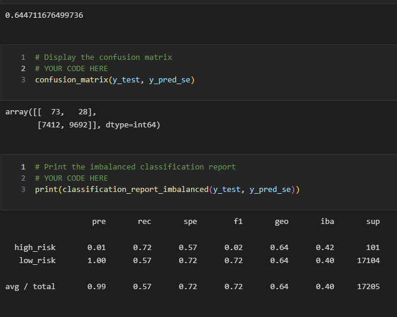

# Credit_Risk_Analysis

## Overview
The purpose of the analysis is to investigate credit risk using the database provided. The database was used to build and evaluate credit risk prediction models.  Due to the imbalance in high- and low-risk database classes, the investigation utilized over, under, combination sampling and ensemble classifier methods. 

The analysis is completed using sklearn's train-test-spilt, imblearn's sampling library and associated functions and libraries.

## Results
### Random Oversampling
The results from the random oversampling technique are summarized in the image below and are:
- The model has a balanced accuracy score of 0.68.
- The random oversampling model predicted 74 True Positives (TP), 27 False Negatives (FN), 6294 False Positives (FP) and 10810 True Negatives (TN).
- The classication report shows that the model has a low precision for predicting high risk consumers. 
- The classication report shows that the model has a recall of 0.73 for predicting high risk consumers. This is not acceptable in predicting high-risk consumers.

### SMOTE Oversampling
The results from the SMOTE technique are summarized in the image below and are:
- The model has a balance accuracy score of 0.66.
- The SMOTE model predicted 70 TP, 31 FN, 6174 FP and 10930 TN.
- The classication report shows that the model has a low precision for predicting high risk consumers. 
- The classication report shows that the model has a recall of 0.69 for predicting high risk consumers. This is not acceptable in predicting high-risk consumers.

### Cluster Centroid Undersampling
The results from the Cluster Centroid technique are summarized in the image below and are:
- The model has a balance accuracy score of 0.56.
- The Cluster Centroid model predicted 66 TP, 35 FN, 9071 FP and 8033 TN.
- The classication report shows that the model has a low precision for predicting high risk consumers. 
- The classication report shows that the model has a recall of 0.65 for predicting high risk consumers. This is not acceptable in predicting high-risk consumers.

### SMOTEEN Combination Sampling
The results from the Cluster Centroid technique are summarized in the image below and are:
- The model has a balance accuracy score of 0.64.
- The Cluster Centroid model predicted 73 TP, 28 FN, 7412 FP and 9692 TN.
- The classication report shows that the model has a low precision for predicting high risk consumers. 
- The classication report shows that the model has a recall of 0.72 for predicting high risk consumers. This is not acceptable in predicting high-risk consumers.

### Balanced Random Forest Classifier
The results from the Balanced Random Forest Classifier technique are summarized in the image below and are:
- The model has a balance accuracy score of 0.78.
- The Balanced Random Forest Classifier model predicted 70 TP, 31 FN, 2149 FP and 14955 TN.
- The classication report shows that the model has a low precision for predicting high risk consumers. 
- The classication report shows that the model has a recall of 0.69 for predicting high risk consumers. This is not acceptable in predicting high-risk consumers.

### Easy Ensemble Classifier
The results from the Easy Ensemble Classifier technique are summarized in the image below and are:
- The model has a balance accuracy score of 0.93.
- The Easy Ensemble Classifier model predicted 93 TP, 8 FN, 900 FP and 16204 TN.
- The classication report shows that the model has a high precision for predicting low risk consumers. 
- The classication report shows that the model has a recall of 92 for predicting high risk consumers. Relative to the other models investigated, this is the best at predicting high-risk credit consumers.

## Summary
The results above illustrate that most of the over, under, combination and ensemble models investigate do not result in high recall/sensitivity scores. The best performing model for predicting high-risk credit consumers is the Easy Ensemble Classifier; this is the recommended model of those evaluated. Other available ensemble models may perform with higher recall/sensitiviy and may be considered if necessary.
